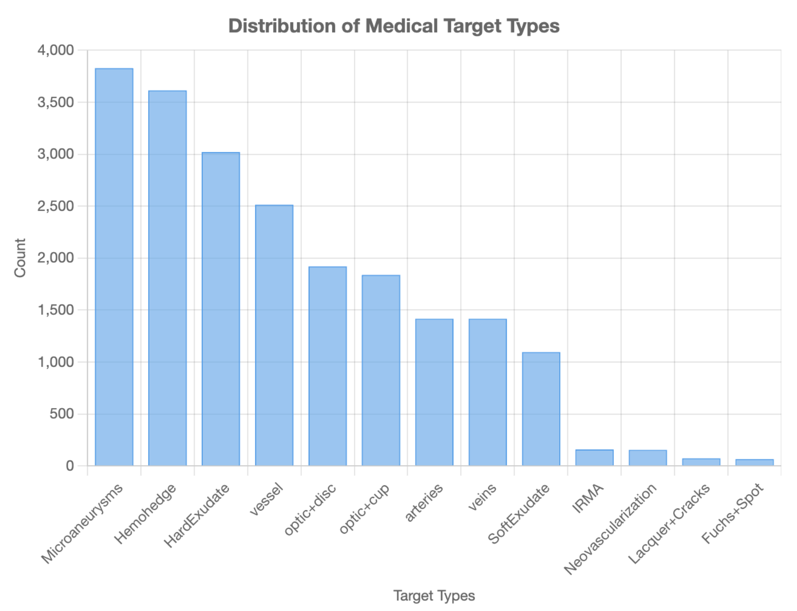
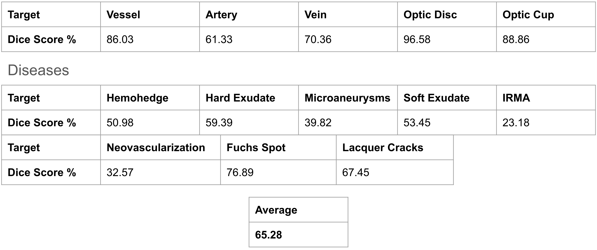
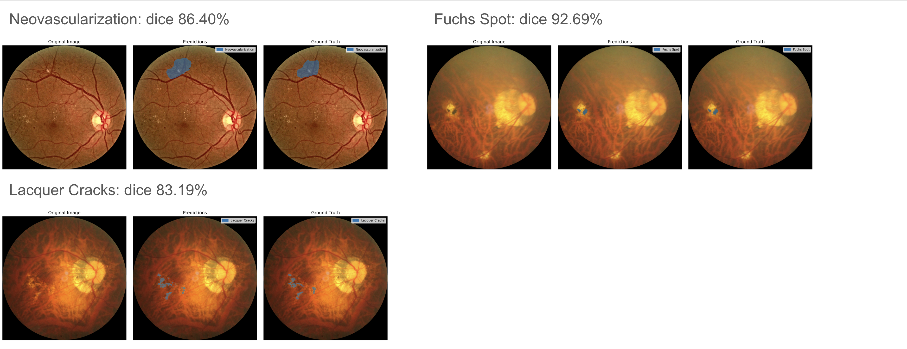

# CSE 428 Final Project Report: CFP-BiomedParse

In this project, I Fine tuning the BiomedParse on all public CFP dataset I collected.

## Datasets
Image counts for Disease Segmentation include data from OIA-DDR (608), TJDR (561), DiaRetDB1 (86), MMAC (181), E-ophta (265), IDRID (81), and FGADR (1,842).

Image counts for ONH Segmentation include data from IDRID (597), LAG (4,854), SUSTech-SYSU (1,220), PAPILA (488), FUND-OCT (200), Drishti-GS1 (100), REFUGE (1,200), CHAKSU (1,345), ARIA (143), and DRIONS-DB (110).

Image counts for AV Segmentation includes DRIVE (40), RVD (>2566), LES-AV (22)

Image counts for Fovea Segmentation are from ARIA (143), and REFUGE (1,200), and SUSTech-SYSU (1,220)

Image counts for Vessel Segmentation include ARIA (143), FIVES (800), HEI-MED (169), DRIVE (40), and RETA (54).

**8031 training 18301 mask, 1377 testing 2825 mask**

## Method

We use the original BiomedParse architecture.

## Experiments

Train on one A4000 GPU for 6.5 days, 20 epochs, batch size 1, Image size (1024, 1024), LR: 1e-5

## Results

## Example ouptuts

## Future Work
Improve texts: Using GenAI to enhance texts and Adding more details into the texts

Adding more modalities into it (OCT, OCTA, FFA,...)

Try to Fine Tuning SAM2 and MedSAM2
